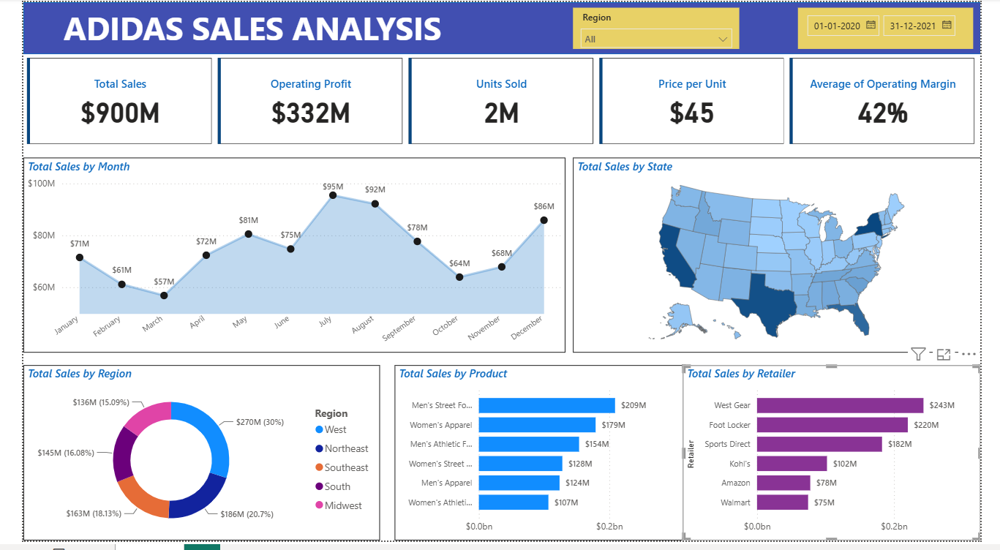

# Adidas Sales Analysis — Power BI Dashboard

An interactive Power BI dashboard analyzing Adidas retail sales performance across the US, built to practice data modeling, DAX, and business dashboard design.

## Overview

This project analyzes Adidas sales data from **January 2020 to December 2021**, covering revenue, profit, and units sold across products, regions, states, and retail partners. The dashboard supports interactive filtering by **Region** and **Date Range** for dynamic exploration.

## Key Metrics

| Metric | Value |
| Total Sales | $900M |
| Operating Profit | $332M |
| Units Sold | 2M |
| Price per Unit | $45 |
| Average Operating Margin | 42% |

## Dashboard Views

- **Total Sales by Month** — tracks monthly revenue trend across 2020–2021, highlighting seasonal peaks (July: $95M) and troughs (October: $64M)
- **Total Sales by State** — US map visualization showing geographic sales concentration
- **Total Sales by Region** — breakdown across West (30%), Southeast (18%), South (20.7%), Midwest (15%), and Northeast (16%)
- **Total Sales by Product** — top-selling categories including Men's Street Footwear ($209M) and Women's Apparel ($179M)
- **Total Sales by Retailer** — performance by retail partner, led by West Gear ($243M) and Foot Locker ($220M)

## Tools & Techniques

- **Power BI** — report design, data modeling, relationships
- **DAX** — calculated measures for KPIs (Operating Margin, Profit)
- **Interactive Filters** — Region slicer and Date Range picker for self-service exploration
- **Data Visualization** — combination of line charts, maps, donut charts, and bar charts to represent different data dimensions

## Key Insights

- The **West region** was the top-performing market at $270M (30% of total sales)
- **July** was the peak sales month at $95M, suggesting a seasonal demand pattern
- **West Gear** and **Foot Locker** were the leading retail partners by revenue
- **Men's Street Footwear** was the best-selling product category

## Files in This Repository

- `Adidas_Sales_Analysis.pbix` — the Power BI project file (open with Power BI Desktop)
- `dashboard-screenshot.png` — static preview image of the dashboard

---
*This is a self-directed learning project using a publicly available practice dataset, built to strengthen skills in Power BI, data modeling, and business dashboard design.*
